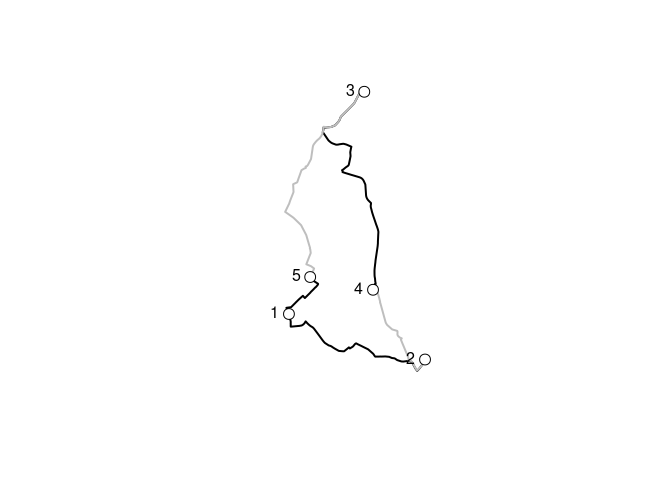
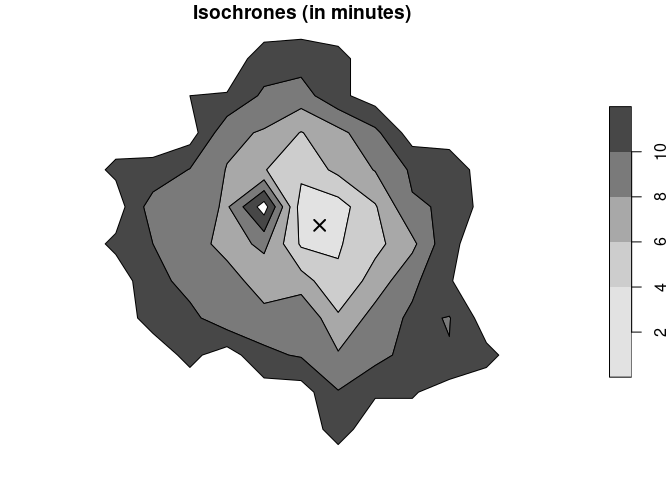

# Summary

`osrm` is an interface between R and the Open Source Routing Machine (OSRM) API. OSRM [@luxen-vetter-2011] is a routing service based on OpenStreetMap (OSM) data. This package enables the computation of routes, trips, isochrones and travel distances matrices (travel times and kilometric distances) based on the OSM road network. 
It contains five functions that interface with OSRM services:

- `osrmTable()` uses the *table* service to query time/distance matrices,
- `osrmRoute()` uses the *route* service to query routes,
- `osrmTrip()` uses the *trip* service to query trips,
- `osrmIsochone()` and `osrmIsometric()` use multiple `osrmTable()` calls to create isochrones or isometric polygons.

An instance of OSRM can be installed on a local or remote server, allowing free and heavy usage of the routing engine.


# Statement of need

Distance based computations and models are at the core of many spatial analysis operations in various scientific fields.
The simplest distance metric is the Euclidean distance (or distance as the crow flies) which is easy and inexpensive to compute. The use of this simple metric may be well fitted to study some phenomenon, such as species distribution or pollution diffusion. 
But whenever research aims at studying human activities (transport of persons or goods for example) it is common to use more realistic metrics based on road distance or travel time.

To compute these metrics with R one has to use packages that interfaces routing engines. Most routing engines are commercial, use tokens to limit the number of requests, or heavily restrict the usage of derived datasets. 
The use of open source software based on open source data enables a high level of transparency useful to research works that aim at reproducibility. 

We argue that `osrm` offers such a level of transparency by relying on the open source software OSRM, which itself uses the open data source OSM.  

`osrm` is already used in various fields such as
transport [@Danesi:2020; @Barroso_2021; @SAVARIA2021102964], 
education [@doi:10.1080/00131881.2017.1339285], 
health [@ijerph18073813; @CHEN2021126; @wisch2022naturalistic; @SNYDER2022102526], 
applied geography [@doi:10.1080/23754931.2018.1519458; @Kandlbinder; @doi:10.1080/23754931.2021.1895875; @Oberst2021hedonischer], 
environmental science [@https://doi.org/10.1111/cobi.13326; @WALKER2021127097], 
urban planning [@XU2019103452; @dey2022urban; @doi:10.1177/23998083211040519] 
and linguistics [@ijgi8090400].  

The use of `osrm` is also suggested by the package for sustainable transport planning `stplanr` [@stplanr]


# State of the field

Several packages exist to compute routes, trips or distance matrices. Most of them rely on commercial and non-free software and use non-free data. See for example `hereR` [@hereR] that uses here services, `gmapsdistance` [@gmapsdistance], `googleway` [@googleway] and `mapsapi` [@mapsapi] that use Google Maps Platform or `mapboxapi` [@mapboxapi] that relies on Mapbox. Using these packages imposes many restrictions on data extraction, analysis and sharing. Other packages use open source routing engines and open data: `graphhopper` [@graphhopper] uses GraphHopper, `opentripplanner` [@openttripplanner] uses OpenTripPlanner, `valhallr` [@val] uses Valhalla. `osrmr` [@osrmr] uses OSRM, it exposes only a small subset of OSRM services and does not handle spatial data formats. 
Among these packages, `osrm` has the advantage of using OSRM, which is easy to install and run on a local or remote server, of giving access to most OSRM services and of handling spatial data formats. 

# Features 

This is a short overview of the main features of `osrm`. The dataset used here is shipped with the package, it is a sample of 100 random pharmacies in Berlin ([© OpenStreetMap contributors](https://www.openstreetmap.org/copyright/en)) stored in a [geopackage](https://www.geopackage.org/) file.  

* `osrmTable()` gives access to the *table* OSRM service. In this example we use this function to get the median time needed to access any pharmacy from any other pharmacy.   

``` r
library(osrm)
```

    ## Data: (c) OpenStreetMap contributors, ODbL 1.0 - http://www.openstreetmap.org/copyright

    ## Routing: OSRM - http://project-osrm.org/


``` r
library(sf)
```

    ## Linking to GEOS 3.9.0, GDAL 3.2.2, PROJ 7.2.1; sf_use_s2() is TRUE

``` r
pharmacy <- st_read(system.file("gpkg/apotheke.gpkg", package = "osrm"), 
                    quiet = TRUE)
travel_time <- osrmTable(loc = pharmacy)
travel_time$durations[1:5,1:5]
```

    ##      1    2    3    4    5
    ## 1  0.0 21.1 33.4 21.2 12.6
    ## 2 22.1  0.0 42.3 16.1 20.2
    ## 3 33.0 43.0  0.0 30.5 27.4
    ## 4 20.1 15.3 29.7  0.0 12.7
    ## 5 10.2 20.3 26.8 12.3  0.0

``` r
diag(travel_time$durations) <- NA
median(travel_time$durations, na.rm = TRUE)
```

    ## [1] 21.4

The median time needed to access any pharmacy from any other pharmacy is 21.4 minutes. 


* `osrmRoute()` is used to compute the shortest route between two points. Here we compute the shortest route between the two first pharmacies. 

``` r
(route <- osrmRoute(src = pharmacy[1, ], pharmacy[2, ]))
```

    ## Simple feature collection with 1 feature and 4 fields
    ## Geometry type: LINESTRING
    ## Dimension:     XY
    ## Bounding box:  xmin: -13170.51 ymin: 5837172 xmax: -3875.771 ymax: 5841047
    ## Projected CRS: WGS 84 / UTM zone 34N
    ##     src dst duration distance                       geometry
    ## 1_2   1   2 21.11667   12.348 LINESTRING (-13170.51 58410...

This route is 12.3 kilometers long and it takes 21.1 minutes to drive through it. 

``` r
plot(st_geometry(route))
plot(st_geometry(pharmacy[1:2,]), pch = 20, add = T, cex = 1.5)
```


* `osrmTrip()` can be used to resolve the travelling salesman problem, it gives the shortest trip between a set of unordered points. In this example we want to obtain the shortest trip between the first five pharmacies. 

``` r
(trips <- osrmTrip(loc = pharmacy[1:5, ], overview = "full"))
```

    ## [[1]]
    ## [[1]]$trip
    ## Simple feature collection with 5 features and 4 fields
    ## Geometry type: LINESTRING
    ## Dimension:     XY
    ## Bounding box:  xmin: -13431.24 ymin: 5837172 xmax: -3875.582 ymax: 5856332
    ## Projected CRS: WGS 84 / UTM zone 34N
    ##   start end duration distance                       geometry
    ## 1     1   2 21.11667  12.3480 LINESTRING (-13170.77 58410...
    ## 2     2   4 16.10833   8.4273 LINESTRING (-3875.582 58379...
    ## 3     4   3 29.69000  18.1448 LINESTRING (-7444.513 58427...
    ## 4     3   5 27.39833  16.4265 LINESTRING (-8027.41 585621...
    ## 5     5   1 10.15333   4.2289 LINESTRING (-11716.36 58435...
    ## 
    ## [[1]]$summary
    ## [[1]]$summary$duration
    ## [1] 104.4667
    ## 
    ## [[1]]$summary$distance
    ## [1] 59.5755

The shortest trip between these pharmacies takes 104.5 minutes and is 59.6 kilometers long. The steps of the trip are described in the "trip" sf object (point 1 > point 2 > point 4 > point 3 > point 5 > point 1).

``` r
mytrip <- trips[[1]]$trip
# Display the trip
plot(st_geometry(mytrip), col = c("black", "grey"), lwd = 2)
plot(st_geometry(pharmacy[1:5, ]), cex = 1.5, pch = 21, add = TRUE)
text(st_coordinates(pharmacy[1:5,]), labels = row.names(pharmacy[1:5,]), 
     pos = 2)
```




* `osrmIsochrone()` computes areas that are reachable within a given time span from a point and returns the reachable regions as polygons. Here we compute the isochrones from a specific point defined by its longitude and latitude. 

``` r
(iso <- osrmIsochrone(loc = c(13.43,52.47), breaks = seq(0,12,2)))
```

    ## Simple feature collection with 5 features and 3 fields
    ## Geometry type: MULTIPOLYGON
    ## Dimension:     XY
    ## Bounding box:  xmin: 13.34397 ymin: 52.41642 xmax: 13.50187 ymax: 52.51548
    ## Geodetic CRS:  WGS 84
    ##   id isomin isomax                       geometry
    ## 1  1      0      4 MULTIPOLYGON (((13.43743 52...
    ## 2  2      4      6 MULTIPOLYGON (((13.42356 52...
    ## 3  3      6      8 MULTIPOLYGON (((13.40345 52...
    ## 4  4      8     10 MULTIPOLYGON (((13.4077 52....
    ## 5  5     10     12 MULTIPOLYGON (((13.42257 52...

``` r
bks <-  sort(unique(c(iso$isomin, iso$isomax)))
pals <- hcl.colors(n = length(bks) - 1, palette = "Light Grays", rev = TRUE)
plot(iso["isomax"], breaks = bks, pal = pals, 
     main = "Isochrones (in minutes)", reset = FALSE)
points(x = 13.43, y = 52.47, pch = 4, lwd = 2, cex = 1.5)
```




# References
